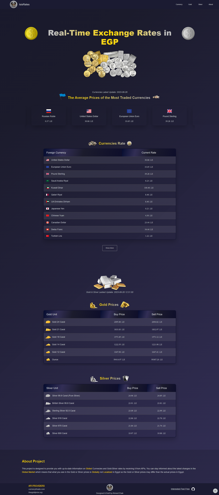

# RateWatch

About Project:

<h2>This project is designed to provide you with up-to-date information on currnecies and Gold-Silver rates by receiving it from APIs.<h2>

### Made with:

» React JS  
» Material-UI  
» Query Lib  
» axios Lib  
» currencyfreaks API  
» freegold API  

Live Link: <a href=''>IsisDom</a>

<h1 align="center" >

</h1>
